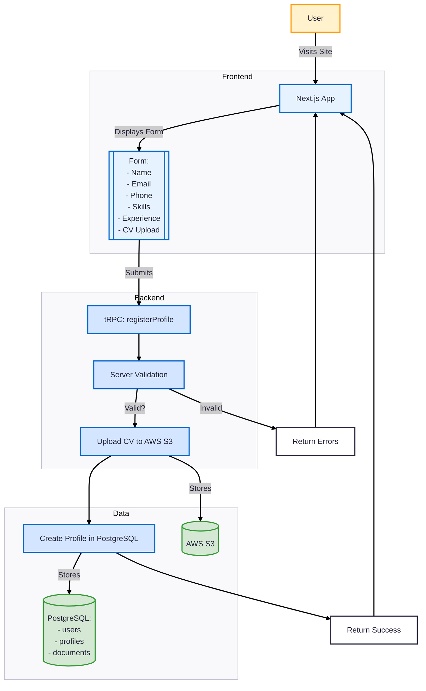

# CV Validation App (Next.js + Node.js + tRPC + PostgreSQL)

This is a full-stack application for uploading a user's CV (PDF) and validating form-entered details against the PDF content using AI.  
The app uses the **T3 Stack** foundation (Next.js, tRPC, Prisma, PostgreSQL) and can be deployed with Docker Compose.

---

## 📌 Features

- **Frontend**: Next.js (React) for UI and form submission.
- **Backend**: Node.js with tRPC endpoints for API calls.
- **Database**: PostgreSQL for storing users, uploads, and validation results.
- **File Upload**: Upload file in AWS S3 Bucket.
- **AI Validation**: Compares form-entered details with extracted PDF text.
- **Deployment**: `docker-compose.yml` for local or production use.

---

## 🗂 Diagram Architecture

## 📝 Quick Write-up

This application allows a user to submit their personal and professional details along with their CV in PDF format.  
The backend extracts the text from the uploaded CV and uses AI to compare it against the form-submitted details.  
If the information matches, the user is shown a success message; if not, they receive feedback on which fields do not match.  

The stack is based on the **T3 Stack** (Next.js, tRPC, Prisma, PostgreSQL) for type-safe end-to-end communication.  
The backend handles file uploads, PDF parsing, AI calls, and validation result storage.  
The frontend provides a simple form with file upload capability and queries for validation results.  
Deployment is handled via **Docker Compose**, allowing the entire system (frontend, backend, and database) to be run locally or in production with minimal configuration.  

---

## ⚠️ Possible Challenges

| Challenge | Description | Mitigation |
|-----------|-------------|------------|
| **Large PDFs** | Some resumes may be lengthy, exceeding AI API token limits. | Chunk text or summarize before sending to AI. |
| **Scanned PDFs** | Some CVs may be images instead of text, making text extraction fail. | Use OCR (e.g., Tesseract) before parsing. |
| **Typos and Data Variations** | Minor differences in names, emails, or skill descriptions may cause false mismatches. | Use fuzzy matching or embeddings-based similarity. |
| **AI API Costs** | Multiple large AI calls may be expensive. | Perform regex/fuzzy checks first, only call AI if uncertain. |
| **File Storage Scaling** | Many uploads can consume storage quickly. | Use S3-compatible storage with lifecycle rules for deletion. |
| **Token Limits in AI Models** | Long text inputs may be truncated by AI services. | Use embeddings or field-specific matching to reduce input size. |

